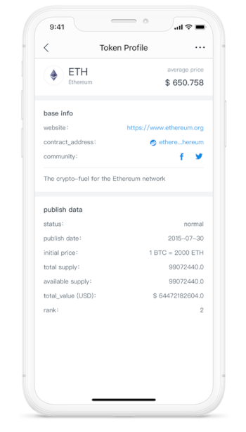
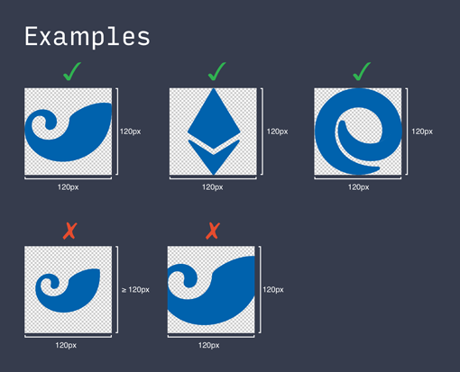

# Token Profile

The purpose of the repo is to make users know more about tokens details.

It will be revealed in imToken 2.0 by going through **Wallet(tab)** -> **Token(for example, ETH)** -> **Token Profile Button(right-top corner)**.



## How it works
1. People make PR to the repo, so that we review and give feedback.
2. When PR is merged, The Token Profile web pages will be built and published.

imToken runs a project named **token-profile-node** which is able to deliver the token profile website automatically and continually.

## How to contribute
**Attention: we only accept the PRs of ERC20 tokens for now**

1. Fork the repo to your account
2. Clone the repo from your own account, rather than the origin one
```
git clone git@github.com:xxxxxxxx/token-profile.git
```
3. Create and switch to a new branch named by your token symbol
4. Add a new json file to the `erc20` directory, which named by the token contract address with **checksum**, for example:
```
0xf90f1648926005A8bb3ed8ec883164De7F768743.json
```
5. Fulfill the content by following the schema of [$template.json](./erc20/$template.json)
6. Add the token logo to `images` directory, which named as same as the json file. For UI concern, we ask you to submit a qualified token logo. The standard is described as below
7. Besides, if you find that your token has been added, you can modify the related file and logo as well
8. Commit the changes
9. Push to your own repo
10. Make a pull request with detailed description
11. We will review your PR as soon as possible, and then merge it into the master branch when everything is fine

## Requirements
### The Effectiveness of Information
You're totally responsible for your commit, so please make sure that the information and logo are real and valid.

### Logo design
- Size: 120x120 pixels
- Transparent background PNG
- Brand identity



## Copyright

2018&copy;imToken PTE. LTD.
