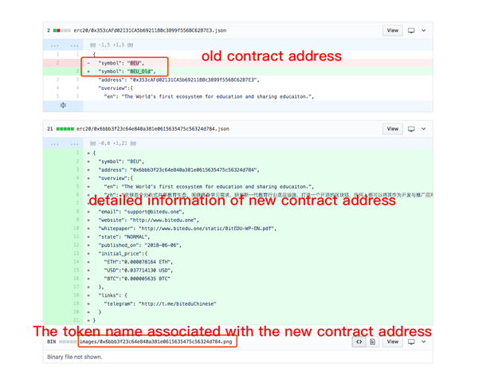

# Token Profile


This repository (repo) creates the Token Profile, which provides an avenue for users to find out more details about your token.


How to access the Token Profile in imToken 2.0?
**Wallet(tab)** -> **Token(for example, ETH)** -> **Token Profile Button(right-top corner)**.


*Read this in other languages: [English](README.md),[简体中文](README.zh-CN.md).*

## How It Works
1. Project developers make a Pull Request (PR) to the repo, the imToken team will review and give feedback accordingly.
2. Once the PR is merged, the Token Profile pages will be created and published. 

imToken runs a **token-profile-node** which updates the token profile pages automatically and continuously to the imToken app.

## How to Contribute
**Attention: we only accept the PRs of ERC20 tokens now**

1. Fork the repo to your own github account.
    *Click on the “Fork” at the top right hand corner*
2. Clone the repo from your own account, rather than the origin one.
```
git clone git@github.com:xxxxxxxx/token-profile.git
```
3. Create a new branch (file) and switch to a new branch named by your token symbol.
4. Add a new json file to the `erc20` directory, named by your token contract address with **checksum**, for example:
```
0xf90f1648926005A8bb3ed8ec883164De7F768743.json
```
5. Please ensure to use UTF-8 encoding for the json file to avoid Travis-CI build error. For the content of the json file, input your project information, with reference to the schema of [$template.json](./erc20/$template.json)
6. Add the token logo to `images` directory, please use the same name as the json file. For UI concerns, please submit a token logo with accordance to the standard specifications, described below.
7. Besides, you may modify the submitted file and logo as well even after your token has been added.
8. Commit the changes.
9. Push the submitted information to your own repo.
10. Under your repo page, click on “New pull request”, input detailed descriptions of the token (including suggested gas limit as default is 60,000; listed exchanges etc).
11. We will review your PR as soon as possible, and subsequently merge it into our master branch.

## Requirements
### The Accuracy of the Submitted Information
You are responsible for the accuracy of the information submitted. Please ensure that the token information, including the Logo is concise and accurate. Please also make sure to submit as much details as possible for your project to help with the review process, including but not limited to the sample provided below. 
*Additional information are appreciated, like renowned blockchain media publications or other justifications for the legitimacy of your projects.*

- Project team background:
- Project current situation:
- Media publications:
- Suggested Gas limit setting (default is 60,000)

Sample PR: https://github.com/consenlabs/token-profile/pull/1636

### Logo Specifications
- Size: 120x120 pixels
- Transparent background PNG format
- Brand logo horizontally and vertically centered , as shown below.


## Frequently asked questions

### Regarding Duplicated Token Names or Contract Amendment

In imToken 1.0, if duplicated token names are found, imToken team will add a number behind the token name for the project who submitted the information later, like TFT1, TFT2 etc. Removing the number is not advisable, as amending the token name will cause the token to disappear from imToken display and may cause unnecessary panic among users. Instead, a better way is to recommend your users to use imToken 2.0, as imToken 2.0 separate tokens via contract address, mitigating the problem of duplicated token names.
 
If there are update requests due to contract amendment, projects are required to make an official announcement for respective community for the change of Symbol, and inform users about the need to search and add the token again in imToken. At the same time, please submit a new Pull Request, add on _OLD to the old contract Symbol (e.g. TFT_OLD), and resubmit new token contract and logo, as shown in the picture below. Please be reminded to share your announcement link under the comment section in the PR, imToken team will evaluate the situation.



### Unable to Search with Token Contract Address
Please check and ensure that there are successful transaction made prior, and please verify your contract information on [Etherscan](https://etherscan.io/) before leaving a comment on your PR, we will troubleshoot manually after.

## Copyright

2018&copy;imToken PTE. LTD.
