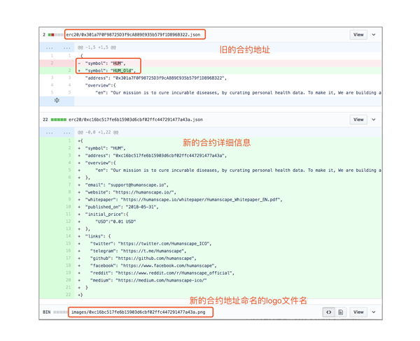

# Token Profile

你可以通过这篇教程了解如何通过 Github 自主提交 token 信息到 imToken，以便于你的 token 信息能在 imToken2.0 APP 里面对应的 token profile 页面显示出来。

该页面位于：
钱包资产首页 -> 对应 Token (以 ETH 为例) -> Token Profile 按钮(页面右上角)。

页面显示如下：


*其他语言版本: [English](README.md),[简体中文](README.zh-CN.md).*

## 具体如何操作？

**注意：我们暂时只接受提交 ERC20 代币信息。**
1. Fork 这个 repo 到你的账户
2. 从你自己的账户里面 clone 这个 repo，注意不是直接 clone 最原始的 repo， 而是 clone 你 fork 的那个 repo

```
git clone git@github.com:xxxxxxxx/token-profile.git
```

3. 创建并且切换到用你的 token symbol 命名的分支里
4. 在 erc20 目录里添加一个新的 json 文件，使用 **checksum** 代币合约地址命名这个 json 文件。举例：
*0xf90f1648926005A8bb3ed8ec883164De7F768743.json*

5. json 文件的内容参照模板文件：[$template.json](./erc20/$template.json)
6. 代币 logo 放到 images 目录里，图片名称也是使用 **checksum** 代币合约地址命名。对于 logo 的要求参照下面的说明
7. 如果你的代币已经被添加了，你可以在对应的目录下更新相应的代币信息
8. commit 提交信息
9. push 提交信息到你的 repo
10. 在你的 repo 页面下点击 `New pull request` 按钮，并附上详细的描述（比如建议设置的 gas ，默认为 60000）
11. 我们会尽快核实你的 PR，如果 PR 没问题我们会合并到主分支下

## 要求
### 资料的有效性和准确性
首先你需要对你提交的资料负责，所以务必保证代币信息的准确度，包括 Logo 等。为了加速显示进度，请尽可能向我们提供完善的项目资料，以及知名区块链媒体报道，包括但不限于以下内容，以便 imToken 团队更了解你们的项目。

- 团队背景：
- 项目基本情况:
- 媒体报道：
- 推荐用户转账所使用的 Gas 数量（没有提供，我们默认值 60000）

PR 示例：https://github.com/consenlabs/token-profile/pull/1636

### Logo 设计要求
- 尺寸: 120x120 像素
- 图片为透明背景的 PNG 格式
- 品牌标识水平竖直居中顶边，见下图


## 常见问题

### 关于重名及修改合约

在 imToken 1.0 里，如果你的项目名称和其它项目重复，我们会在后面加数字，如TFT1、TFT2、TFT3等；如果你希望去掉数字，我们首先声明，这是一个非常危险的操作，修改代币信息后，代币会突然消失，容易引起用户恐慌，原则是对于持币人数多的项目，我们建议项目方推荐用户下载使用 imToken 2.0 ，imToken 2.0 通过代币合约地址来区分代币，所以不存在代币名称重复。

其他情况，如需要修改合约地址，需要项目方在社区发布修改 Symbol 公告，告知用户需要从新搜索添加。并在 github 提交新的 PR，将旧合约 Symbol 增加 _OLD ，如  TFT_OLD, 然后提交新的代币合约和 logo, 如下图所示，并把公告链接在 PR 下留言，我们会核实情况修改。



### 无法通过合约搜索
通过合约地址搜索不出来的情况，请查看是否是并未有成功的转账记录，另外请在 [Etherscan](https://etherscan.io/) Verify 你的合约信息，我们可以帮你手动添加。

## Copyright

2018&copy;imToken PTE. LTD.