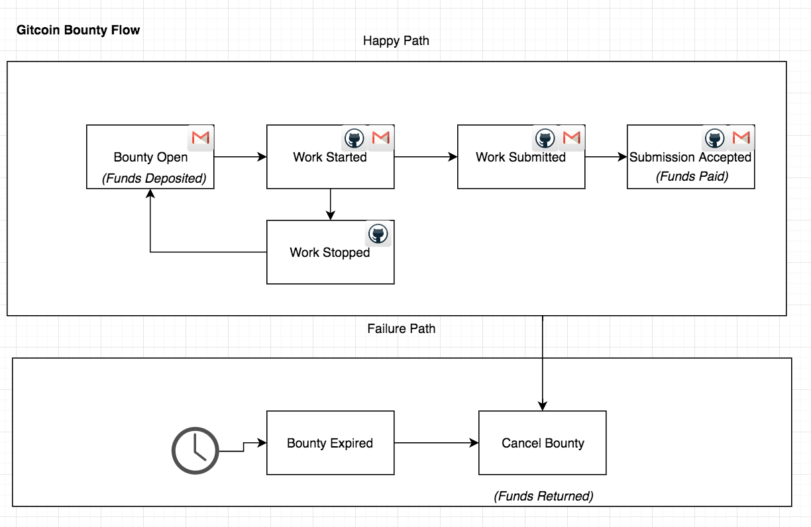

# Gitcoin

Gitcoin Grows Open Source. Learn more at [https://gitcoin.co](https://gitcoin.co)

# web repo

This is the website that is live at gitcoin.co

## How to interact with this repo

### Table of Contents

- [Gitcoin](#gitcoin)
- [web repo](#web-repo)
  * [How to interact with this repo](#how-to-interact-with-this-repo)
    + [On Github](#on-github)
    + [On Gitcoin](#on-gitcoin)
  * [What](#what)
- [Developing](#developing)
  * [HTTPS API](#https-api)
  * [Running Locally](#running-locally)
- [Trying out Gitcoin](#trying-out-gitcoin)
  * [Posting your first issue](#posting-your-first-issue)
- [Integrating Gitcoin](#integrating-gitcoin)
  * [Integrating the 'available work widget' on your repo.](#integrating-the--available-work-widget--on-your-repo)
  * [Adding GitcoinBot to your repo](#adding-gitcoinbot-to-your-repo)
  * [Adding your token to Gitcoin](#adding-your-token-to-gitcoin)
- [Legal](#legal)
- [License](#license)

### On Github

[Star](https://github.com/gitcoinco/web/stargazers) and [watch](https://github.com/gitcoinco/web/watchers) this github repository to stay up to date, we're pushing new code several times per week!

Check out the [CHANGELOG](./CHANGELOG.md) for details about recent changes to this repository.

Also,

* want to become a contributor ? Checkout our [guidelines](./CONTRIBUTING.md).
* [check out the gitcoinco organization-wide repo](https://github.com/gitcoinco/gitcoinco).
* check out the open issues list, especially the [discussion](https://github.com/gitcoinco/web/issues?q=is%3Aissue+is%3Aopen+label%3Adiscussion) label and [easy-pickings](https://github.com/gitcoinco/web/issues?q=is%3Aissue+is%3Aopen+label%3Aeasy-pickings).

### On Gitcoin

[Check out the available open issues on Gitcoin](https://gitcoin.co/explorer/?q=https://github.com/gitcoinco/web).

## What

Functionally, the app has several key features:

* Smart Contracts -- Where funded issues are stored and indexed.
* Brochureware -- Describes the project.
* Funded Issue Explorer -- A searchable index of all of the work available in the system.
* Funded Issue Submission / Acceptance flow -- Interface between the application and web3.
* API - the HTTPS API
* Bot - the GitcoinBot

[More about how/why to interact with web3 here](https://gitcoin.co/web3).

Technically, the system is architected:

* __Web3__ The main source of truth for the system is the Ethereum blockchain. Check out the [smart contracts](https://github.com/gitcoinco/smart_contracts).
* __Web2__ This part of the app is built with Python, Django, Postgres, and a handful of other tools that are common in the web2 ecosystem.
* __Web 3 Bridge__ This is the bridge between web3 and the rest of the application. Mostly built in javascript(web3js) and python(web3py).
* __Brochureware__ Just a nice little landing page telling folks what the Gitcoin project is.

# Developing

## HTTPS API

[For more information on the HTTPS API, please view the api README](API.md)

## Running locally

### With Docker (Recommended)

[For more information on running the app locally, please view the running locally README](RUNNING_LOCALLY_DOCKER.md)

### Without Docker

[For more information on running the app locally, please view the running locally README](RUNNING_LOCALLY.md)

## Overriding Application Defaults

[For more information on overriding the local dev environment configuration defaults, please view the environment variables documentation](ENVIRONMENT_VARIABLES.md)

# Trying out Gitcoin

## Posting your first issue

If you

* have some work on your Github Issues board that you don't have time (or skills) to do.
* are dependant upon an upstream repo for something, and you'd like to incentivize them to work onit.

try posting a funded issue at [https://gitcoin.co/new](https://gitcoin.co/new).

# Integrating Gitcoin

## Integrating the 'available work widget' on your repo.

This widget will help you advertise that you support Gitcoin bounties, so that your community knows the best place to contribute.

[Check out the widget readme to learn how](WIDGET.md)

## Adding GitcoinBot to your repo

Gitcoinbot will allow you to add issues straight from github.

[Check out the gitcoinbot readme to learn how](app/gitcoinbot/)

## Adding your token to Gitcoin

Have an ERC20 compatible token that you'ud like to add support for?  Great!

[Here is an example of how to do it](https://github.com/gitcoinco/web/pull/155)

## High Level flow of a Bounty

This is the high level flow of a bounty on Gitcoin:

# Legal

'''
    Copyright (C) 2018 Gitcoin Core

    This program is free software: you can redistribute it and/or modify
    it under the terms of the GNU Affero General Public License as published
    by the Free Software Foundation, either version 3 of the License, or
    (at your option) any later version.

    This program is distributed in the hope that it will be useful,
    but WITHOUT ANY WARRANTY; without even the implied warranty of
    MERCHANTABILITY or FITNESS FOR A PARTICULAR PURPOSE. See the
    GNU Affero General Public License for more details.

    You should have received a copy of the GNU Affero General Public License
    along with this program. If not, see <http://www.gnu.org/licenses/>.

'''

# License

[GNU AFFERO GENERAL PUBLIC LICENSE](../LICENSE)

<!-- Google Analytics -->

